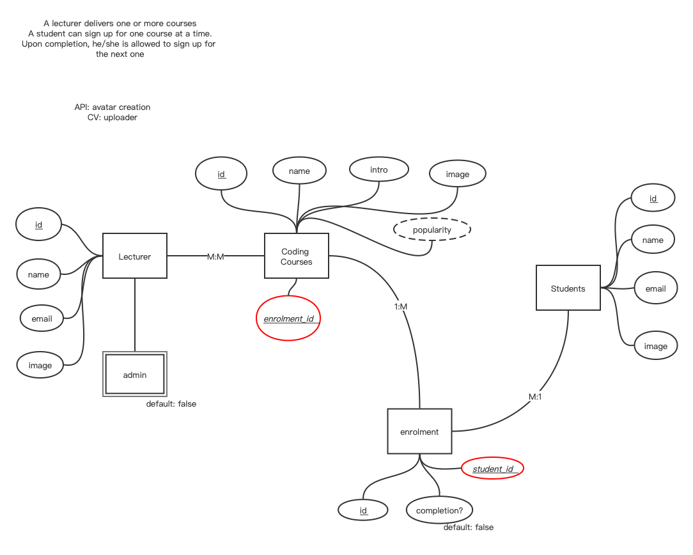
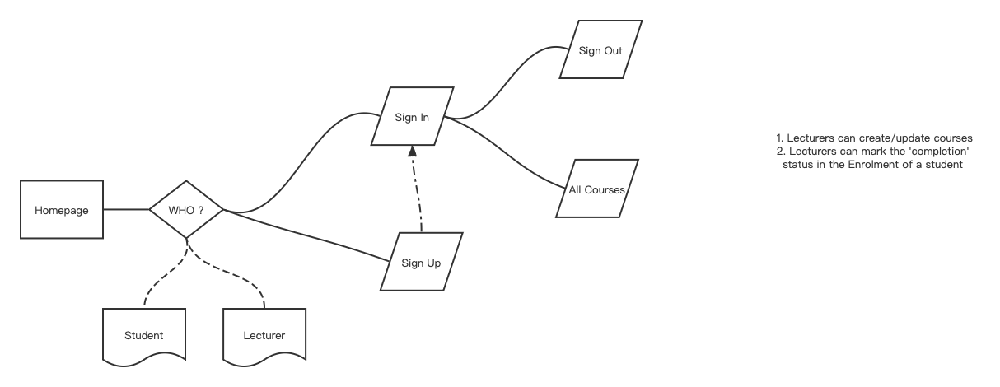

# README

# Design 

## Schema 

## Website flowchart 


## Features 
1. 2 portals for students and lecturers 
2. API for avatar picture auto-creation
3. API for teams / zoom meetings  

# Development Log 
## 20-01-2023
* Ruby version
  This project is built on *ruby 2.7.7p221 (2022-11-24 revision 168ec2b1e5) [arm64-darwin22]*. 

* Database creation
    ```shell
    rails db:create 
    
    # 1:M relationship between Students and Enrolments 
    rails g model Student name:text email:text image:text
    rails db:migrate
    
    rails g model Enrolment completion:boolean student_id:integer
    rails db:migrate 
    
    # 1:M relationship between Enrolments and Courses
    rails g model Courses name:text intro:text image:text enrolment_id:integer
    rails db:migrate 
    
    # Lecturer table 
    rails g model Lecturer name:text email:text image:text admin:boolean
    rails db:migrate 
    
    # M:M relationship : ioin Lecturers and Courses
    rails g migration create_courses_lecturers course_id:integer lecturer_id:integer
    ## remove the automatically created id for the join table before migration
    rails db:migrate
    
    ```
* Database initialization
* Data Association 
  1. 1:M Students and Enrolments
  - `student.rb` 
      ```ruby 
      class Student < ApplicationRecord
          has_many :enrolments
      end
      ```
  - `erolment.rb`
    ```ruby
      class Enrolment < ApplicationRecord
          belongs_to :students, :optional => true 
      end
    
    ```
  2. 1:M Enrolments and Courses 
  - `enrolment.rb`
      ```ruby
          class Enrolment < ApplicationRecord
              belongs_to :students, :optional => true 
              belongs_to :course, :optional => true 
          end
      ```
  - `course.rb`
    ```ruby
      class Course < ApplicationRecord
          has_many :enrolments
      end
    ```
  3. M:M Lecturers and Courses 
  - `course.rb`
    ```ruby
      class Course < ApplicationRecord
          has_many :enrolments
          has_and_belongs_to_many :lecturers
      end
    ```
  - `lecturer.rb`
    ```ruby
      class Lecturer < ApplicationRecord
          has_and_belongs_to_many :courses
      end
    ```
* Seed Sample Data 
    ```shell
    rails db:seed 
    ```


### Prolems and Fixes 
1. Issue 1 : incorrect FK in Courses table [FIXED]
   ```shell
    rails generate migration add_course_id_to_enrolments course_id:integer
    rails db:migrate 
   ```
2. Issue 2: incorrect associations [FIXED]
   ```ruby
    puts "Students and Enrolments"
    s1.enrolments << e1 << e2
    s2.enrolments << e3 << e4
    puts "Done 1"
   
    puts "Enrolments and Courses"
    c1.enrolments << e1
    c2.enrolments << e2
    c3.enrolments << e3
    c4.enrolments << e4
    puts "Done 2"
   ```

## 21-01-2023
* Home Page creation
  ```shell 
    rails g controller Pages index --skip-routes
  ```
  `index.html.erb` and `pages_controller.rb` updates 

* `Students` controller and views createion 
  ```shell
    rails g controller Students index show new edit --skip-routes 
  ```
## 22-01-2023
* `students` 
  - `index` 
    - `index` action defined in `studnet_controller.rb` 
    - `index.html.erb`
  - `show` 
    - link_to set up for each student on index page 
    - `show.html.erb`
    - `show` action defined in the controller 
    -`new`
    - define the `new` action in the controller 
    - create a partial `_form.html.erb` 
  - `edit`
    - define the `edit` action in the controller 
    - update `edit.html.erb` using partial `_form.html.erb` 
  - `update`
    - define the `update` action in the controller 

  - `destroy`
    - define the `destroy` action in the controller 
    - set up `delete` button in the show page 
* `lecturers` - part i
  - controller and views creation 
    ```shell
    rails g controller Lecturers --skip-routes
    ```
    - define the routes
  - `index`
    - define the `index` action in the controller
    - update the `index.html.erb` 


### Problems and Fixes 
- How to display the courses a student enrols in? The courses table is indirectly connected to the students via the enrolments table. [FIXED]
  ```
    enrolment.course.name 
  ```

- Move the database from Sqlite3 to PostgreSQL [FIXED]
  credits to: https://medium.com/@virtual_khan/converting-rails-from-sqlite3-to-postgresql-d97023314a14


## 23-01-2023
* `lecturers` - part ii
  - `show` 
    - define the `show` action in the controller 
    -  show view 
 - `new` 
   - define the `new` action in the controller
   - create a partial `_form.html.erb` for `lecturers`
 - `create`
   - define the `create` action in the controller
 - `edit` 
   - define the `edit` action in the controller
   - `edit.hmtl.erb` added and edited
   - partial `form` added to the `edit.hmtl.erb` 
 - `update`
   - define the `update` action in the controller
 - `destroy`
   - define the `destroy` action in the controller 
   - set up `delete` button in the show page 


* `courses` 
- `courses` controller and views created 
  ```shell
    rails g controller Courses index show new edit --skip-routes
  ```
- routes set up
- navigation bar added to all pages 

  - `index`
    - define the `index` action in the controller
    - `index.html.erb` edited
  - `show`
    - define the `show` action in the controller
    - `show.hmtl.erb` edited
  - `new`
    - define the `new` action in the controller
    - create a partial `_form.html.erb` for `courses`
    - `new.html.erb` edited
  - `create`
    - define the `create` action in the controller 
  - `edit` 
    - define the `edit` action in the controller
    - `edit.hmtl.erb` edited 
  - `update`
    - define the `update` action in the controller
  - `destroy`
    - define the `destroy` action in the controller
    - set up the `delete` button in the show page 

* set up `password` authentication for `students`
  - command 
    ``` shell
      rails g migration add_password_digest_to_students password_digest:string

      rails db:migrate
    ```
  - turn on the password authentication in `Gemfile` and install `bundle`
  - add `has_secure_password` to `student.rb` model 
  - add password authentication and error messages to `_form.html.erb` for `students`
  - add password authentication to `create` in the controller

* set up `sessions` for login purpose for `students`
  - update the routes 
  - generation `session` 
    ```shell 
      rails g controller Session --skip-routes
    ```
  - update the home page `application.html.erb`
  - create `new.html.erb` in `session` for `students`
  - `session_controller` set up for the student to log in 

### Problems and Fixes 
- `password` added to the forms of `students` and `lecturers` [FIXED]
- Add password authentication to `update` [FIXED]
- `admin` added to the forms of `lecturers`
- Display `enrolment` and `courses` for `students`
- Display `courses` for `lecturers` 


## 24-01-2023
* `sign in` for `students`
  - homepage info for a successful login session 
    - a private action defined in to fect student in `application_controller.rb` 
    - `before_action :fecth_student` is placed in `student_controller.rb`
* `sign out` for `students` 
  - `application.html.erb` : nav bar added 
  - define `destroy` action in `session_controller` for `students`
  - remove `sign up` option when a student successfully signs in 
  - auto `sign in` once a new `sign up` is successfully signed performed 

- ~ update the authentication conditions for `students` 
  ```ruby
    :email, :uniqueness => true, :presence => true
  ```

* `lecturers`
- `lecturer_controller` : copy and paste the controller from `student_controller.rb`
- `authenticate` set up for `lecturers` 
  ```shell
    rails g migration add_password_digest_to_lecturers password_digest:string
    rails db:migrate
  ```
- `lecturer.rb` : password and authentication 
- `session` for `lecturers`

### Problems and Fixes
- customized welcome message is not showing in the homepage for `session[:stduent_id]` [FIXED]
  - 1. typo of the action 
  - 2. the action must be defined in `application_controller.rb`

- error message is not shown for invalid signin [FIXED]
  - `flash[:error]` shall be called in the session new view 

# What to do next? 
1. a student account:
   1. can see
      1. all courses ✅
      2. all lecturers ✅
   2. cannot see
      1. edit, delete buttons for courses ✅
      2. edit, delete buttons for lecturers ✅
      3. all student list ✅ 
      4. new course ✅ 
2. a lecturer acccount
   1. can see
      1. all student 
      2. all courses
      3. all lecturers
      4. new course 
   2. cannot see
      1.  edit and delete buttons for other lecturers 
3. an admin account
   1. can see
      1. everything
4. how to add the column of courses to teach when a new lecturer signs up ? 